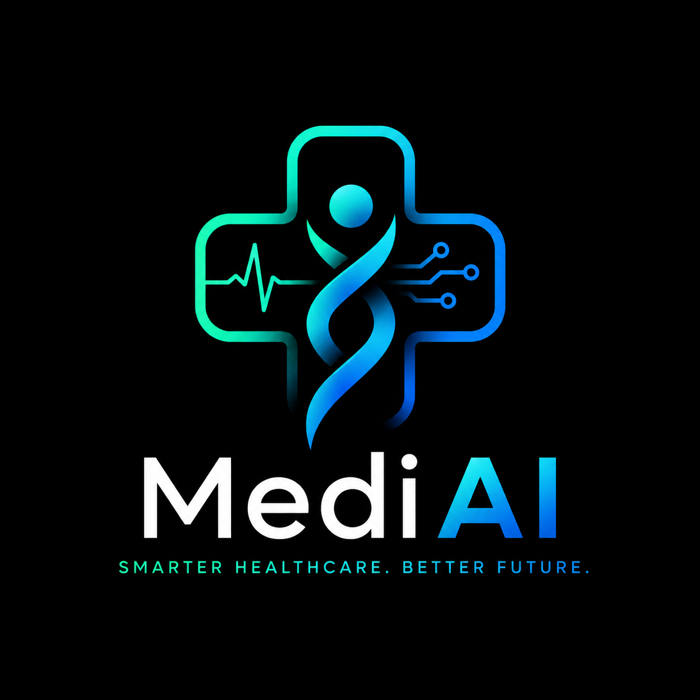

<p align="center">
  
</p>

<h1 align="center">MediAI</h1>

<p align="center">
  <strong>Autonomous Multi-Agent Clinical Intelligence Platform</strong><br/>
  <em>Bridging the 4.5-billion-person primary healthcare gap through AI-powered triage, multilingual voice-first symptom analysis, and real-time emergency dispatch.</em>
</p>

<p align="center">
  
  
  
  
  
  
</p>

---

## 🎯 The Problem

> *Half the world lacks access to essential health services. 100 million people are pushed into extreme poverty because of health expenses every year.* — **World Health Organization, 2023**

Rural communities, elderly individuals, and non-English speakers face a compounding crisis: **no nearby doctors, no digital literacy, and no way to determine if their symptoms are life-threatening.** A mother in rural Karnataka shouldn't have to travel 40 km just to learn her child's fever is manageable at home — or worse, wait too long when it isn't.

## 💡 Our Solution

**MediAI** is an end-to-end clinical intelligence platform that acts as a **first-responder AI doctor** — available 24/7, in 7 Indian languages, on any device. It doesn't just answer medical questions; it **triages**, **dispatches ambulances**, **tracks medications**, **analyzes wounds through photos**, and **connects patients to real specialists** — all within a single, unified experience.

---

## ✨ Feature Highlights

<table>
  <tr>
    <td width="50%">
      <h3>🧠 Multi-Agent Symptom Intelligence</h3>
      <p>A coordinated pipeline of specialized AI agents processes every symptom query:</p>
      <ul>
        <li><strong>BioClinicalBERT</strong> — Clinical Named Entity Recognition extracts medical concepts from free-text descriptions</li>
        <li><strong>BiomedNLP-BiomedBERT</strong> — Triage severity classification scores urgency on a 0–100 risk scale</li>
        <li><strong>BGE-Large-EN-v1.5</strong> — Semantic embeddings power RAG retrieval against WHO/CDC/NIH clinical guideline vectors</li>
        <li><strong>Mistral Large</strong> — Generates the final grounded, hallucination-resistant patient guidance</li>
      </ul>
      <p><em>Result: Three-tier triage output (🔴 Emergency → 🟡 Visit Clinic → 🟢 Home Care) with evidence-cited clinical recommendations.</em></p>
    </td>
    <td width="50%">
      <h3>🚑 One-Tap SOS Emergency Dispatch</h3>
      <p>A single button press triggers a full emergency pipeline:</p>
      <ul>
        <li><strong>GPS Geolocation</strong> — High-accuracy device coordinates are captured instantly</li>
        <li><strong>Geoapify Hospital Routing</strong> — Nearest hospitals are located within a dynamic radius, with real driving-distance ETA</li>
        <li><strong>Telegram Instant Alerts</strong> — Emergency notifications with patient name, GPS pin, and hospital details are dispatched to caregivers in real-time</li>
        <li><strong>5-second safety countdown</strong> — Prevents accidental triggers with a cancellable countdown UI</li>
      </ul>
    </td>
  </tr>
  <tr>
    <td width="50%">
      <h3>👁️ Multimodal Vision Analysis Lab</h3>
      <p>Upload or photograph wounds, rashes, and skin conditions for AI-powered visual diagnosis:</p>
      <ul>
        <li><strong>OpenAI CLIP</strong> — Zero-shot image classification against 5 clinical categories (infected wound, dermatitis, conjunctivitis, allergy, healthy skin)</li>
        <li><strong>RGB Pixel Analyzer</strong> — Local fallback that scans redness density, purulent discharge levels, and tissue integrity without any API dependency</li>
        <li><strong>Supabase Storage</strong> — All scans are persisted in a private per-user gallery for longitudinal tracking</li>
      </ul>
    </td>
    <td width="50%">
      <h3>💊 Medication Adherence Tracker</h3>
      <p>A complete prescription management system with intelligent alerting:</p>
      <ul>
        <li><strong>Custom scheduling</strong> — Set Morning/Afternoon/Night frequencies or exact alarm times</li>
        <li><strong>Drug Interaction Auditor</strong> — Cross-references newly added medications against an interaction matrix (e.g., Aspirin + Warfarin → bleeding risk)</li>
        <li><strong>Automated Telegram Reminders</strong> — Time-matched background scheduler dispatches real Telegram alerts at the exact scheduled minute</li>
        <li><strong>Supabase persistence</strong> — Medication records sync across devices via authenticated cloud storage</li>
      </ul>
    </td>
  </tr>
  <tr>
    <td width="50%">
      <h3>🌍 7-Language Voice-First Accessibility</h3>
      <ul>
        <li><strong>Languages:</strong> English, Hindi, Tamil, Telugu, Kannada, Bengali, Marathi</li>
        <li><strong>Voice Input:</strong> Browser-native Web Speech Recognition API with language-aware transcription</li>
        <li><strong>Voice Output:</strong> Speech Synthesis reads clinical guidance aloud with auto-detected script language</li>
        <li><strong>Elderly Mode:</strong> One-toggle accessibility mode scales the entire UI, slows speech rate, and adds auditory navigation cues</li>
        <li><strong>Full response translation:</strong> Clinical guidelines, triage explanations, and action steps are all translated server-side via Mistral</li>
      </ul>
    </td>
    <td width="50%">
      <h3>📅 Telehealth Clinician Matching</h3>
      <ul>
        <li><strong>Symptom-aware routing:</strong> Doctors are matched by specialty based on the patient's most recent symptom profile from Supabase chat history</li>
        <li><strong>Proximity sorting:</strong> Device GPS coordinates rank specialists by real-world distance</li>
        <li><strong>Live video consultations:</strong> Integrated telemedicine interface with simulated 1080p encrypted session feeds</li>
        <li><strong>Supabase booking:</strong> Appointments are persisted with auto-generated Zoom links and confirmed status</li>
      </ul>
    </td>
  </tr>
</table>

---

## 🏗️ System Architecture

```mermaid
graph TB
    subgraph Client["📱 Client Layer"]
        Web["🌐 React Web App"]
        Android["📱 Android (Capacitor)"]
        iOS["🍎 iOS (Capacitor)"]
    end

    subgraph Frontend["⚛️ React + Vite Frontend"]
        Landing["Landing Page"]
        Auth["Supabase Auth"]
        Dashboard["Clinical Dashboard"]
        Chat["Symptom Chat"]
        Vision["Vision Lab"]
        Meds["Med Tracker"]
        Docs["Doctor Match"]
        SOS["SOS Emergency"]
    end

    subgraph Backend["🐍 FastAPI Backend"]
        API["REST API Server"]
        SymptomEP["POST /api/symptoms/analyze"]
        VisionEP["POST /api/vision/analyze"]
        MedsEP["POST /api/medications/remind"]
        DoctorEP["GET /api/doctors"]
        EmergencyEP["POST /api/emergency/trigger"]
    end

    subgraph ML["🧠 ML Intelligence Layer"]
        NER["BioClinicalBERT<br/>(Clinical NER)"]
        Triage["BiomedBERT<br/>(Triage Scoring)"]
        RAG["BGE-Large + ChromaDB<br/>(RAG Retrieval)"]
        LLM["Mistral Large<br/>(Response Generation)"]
        CLIP["OpenAI CLIP<br/>(Vision Classification)"]
        Whisper["Whisper Large v3<br/>(Speech-to-Text)"]
        Pixel["RGB Pixel Analyzer<br/>(Local Fallback)"]
    end

    subgraph External["🔌 External Services"]
        Supa["Supabase<br/>(Auth + DB + Storage)"]
        Geo["Geoapify<br/>(Hospital Routing)"]
        Tele["Telegram Bot API<br/>(Alerts + Dispatch)"]
        HF["Hugging Face<br/>(Inference API)"]
        Mistral["Mistral AI<br/>(LLM + Translation)"]
    end

    Client --> Frontend
    Frontend --> Backend
    Backend --> ML
    ML --> External
    Backend --> External
```



---

## 🧬 Technical Deep-Dive: The Symptom Analysis Pipeline

When a patient submits a symptom query, the following orchestrated pipeline executes:

```
Patient Input (any of 7 languages)
        │
        ▼
┌─────────────────────────────┐
│  1. TRANSLATION AGENT       │  Mistral Large detects non-English
│     (Mistral Large)         │  scripts and translates to clinical
│                             │  English for downstream processing
└──────────┬──────────────────┘
           ▼
┌─────────────────────────────┐
│  2. ENTITY EXTRACTION       │  BioClinicalBERT (HF Inference) or
│     (BioClinicalBERT)       │  local clinical dictionary with
│                             │  negation-aware regex matching
└──────────┬──────────────────┘
           ▼
┌─────────────────────────────┐
│  3. TRIAGE SCORING          │  BiomedBERT classifies urgency
│     (BiomedBERT)            │  using keyword severity mapping
│                             │  → Emergency / Clinic / Home Care
└──────────┬──────────────────┘
           ▼
┌─────────────────────────────┐
│  4. RAG RETRIEVAL           │  BGE-Large-EN-v1.5 generates query
│     (BGE + ChromaDB)        │  embeddings → cosine similarity
│                             │  search against WHO/CDC/NIH vectors
│                             │  stored in ChromaDB
└──────────┬──────────────────┘
           ▼
┌─────────────────────────────┐
│  5. RESPONSE GENERATION     │  Mistral Large synthesizes a
│     (Mistral Large)         │  grounded, translated response
│                             │  citing retrieved clinical evidence
└──────────┬──────────────────┘
           ▼
    Patient receives:
    • Triage classification with risk score
    • Evidence-grounded clinical guidance
    • Actionable safety recommendations
    • Full response in their selected language
```

---

## 📂 Repository Structure

```
MediAI/
├── 📄 .env                           # API keys (Mistral, HF, Telegram, Geoapify)
├── 📄 README.md                      # You are here
│
├── 🐍 backend/                       # FastAPI Server
│   ├── main.py                       # 590-line API core: symptoms, vision, SOS,
│   │                                 #   doctor matching, medication CRUD, Telegram
│   ├── requirements.txt              # Python dependencies
│   ├── medications_store.json        # Local persistence fallback
│   └── consultations_store.json      # Consultation records fallback
│
├── ⚛️  frontend/                      # React + Vite SPA
│   ├── src/
│   │   ├── App.jsx                   # Global state coordinator, SOS logic, nav
│   │   ├── supabaseClient.js         # Supabase SDK initialization
│   │   ├── index.css                 # Glassmorphic design system (dark theme)
│   │   └── components/
│   │       ├── LandingPage.jsx       # Animated hero with 3D neural background
│   │       ├── Auth.jsx              # Supabase email/password authentication
│   │       ├── NeuralBackground.jsx  # Three.js + React Three Fiber particles
│   │       ├── Dashboard.jsx         # Clinical command center with live stats
│   │       ├── SymptomChat.jsx       # Multi-agent chat with voice + telemetry
│   │       ├── VisionLab.jsx         # CLIP-powered wound/rash scanner
│   │       ├── MedTracker.jsx        # Prescription scheduler + drug auditor
│   │       └── DocMatch.jsx          # Geolocation-aware doctor matching
│   ├── capacitor.config.ts           # Capacitor mobile build config
│   ├── .env                          # Frontend API URL (configurable per target)
│   └── android/                      # Generated Android Studio project
│
└── 🧠 ml/                            # Machine Learning Intelligence Layer
    ├── agents.py                     # BioClinicalBERT NER + BiomedBERT triage
    │                                 #   + Mistral translation agent
    ├── rag.py                        # BGE embeddings, ChromaDB vector store,
    │                                 #   cosine retrieval, 7-language translations
    ├── vision.py                     # CLIP zero-shot classification +
    │                                 #   RGB pixel-level wound analyzer
    └── voice.py                      # Whisper Large v3 audio transcription
```

---

## ⚙️ Quick Start

### Prerequisites

- **Python 3.9+** and **Node.js 18+**
- API keys for: [Mistral AI](https://console.mistral.ai/), [Hugging Face](https://huggingface.co/settings/tokens), [Geoapify](https://www.geoapify.com/), and optionally [Telegram Bot](https://core.telegram.org/bots)

### 1 · Environment Configuration

Create a `.env` file in the project root:

```bash
# LLM Provider (Required — powers response generation + translation)
MISTRAL_API=your_mistral_api_key

# Hugging Face (Required — powers BioClinicalBERT, BiomedBERT, BGE, CLIP, Whisper)
HF_API_TOKEN=your_hugging_face_token

# Geoapify (Required — powers hospital routing + SOS dispatch)
GEOAPIFY_API_KEY=your_geoapify_key

# Telegram Bot (Optional — enables real-time medication + emergency alerts)
TELEGRAM_BOT_TOKEN=your_telegram_bot_token
TELEGRAM_CHAT_ID=your_telegram_chat_id
```

### 2 · Launch the Backend

```bash
cd backend
python -m venv venv
source venv/bin/activate        # Windows: venv\Scripts\activate
pip install -r requirements.txt
uvicorn main:app --reload --port 8000
```

> The API is now live at `http://127.0.0.1:8000` — interactive docs at [`/docs`](http://127.0.0.1:8000/docs)

### 3 · Launch the Frontend

```bash
cd frontend
npm install
npm run dev
```

> Open `http://localhost:5173` in your browser.

### 4 · Deploy to Android *(Optional)*

```bash
# Update frontend/.env to point to your machine's WiFi IP:
# VITE_API_URL=http://192.168.x.x:8000  (physical device)
# VITE_API_URL=http://10.0.2.2:8000     (Android emulator)

cd frontend
npm run build
npx cap sync android
npx cap run android              # or: npx cap open android
```

---

## 🩺 Patient Journey Walkthrough

<table>
  <tr>
    <td align="center" width="20%"><strong>Step 1</strong><br/><code>Landing</code></td>
    <td>Cinematic landing page with <strong>Three.js neural particle background</strong> and call-to-action entry. Animated via React Three Fiber.</td>
  </tr>
  <tr>
    <td align="center"><strong>Step 2</strong><br/><code>Authentication</code></td>
    <td><strong>Supabase Auth</strong> — Email/password sign-up with persistent sessions. User profiles stored in Supabase PostgreSQL.</td>
  </tr>
  <tr>
    <td align="center"><strong>Step 3</strong><br/><code>Dashboard</code></td>
    <td>Clinical command center showing <strong>live triage status</strong>, medication counts, upcoming appointments, and quick-access feature cards. Real-time Supabase sync.</td>
  </tr>
  <tr>
    <td align="center"><strong>Step 4</strong><br/><code>Symptom Chat</code></td>
    <td>Describe symptoms via <strong>text or voice</strong> in any of 7 languages. Watch the <strong>live agent telemetry console</strong> as BioClinicalBERT, BiomedBERT, BGE, and Mistral process your query in real-time. Receive a triage-classified, evidence-grounded clinical response.</td>
  </tr>
  <tr>
    <td align="center"><strong>Step 5</strong><br/><code>Vision Lab</code></td>
    <td>Upload a wound/rash image. The system runs <strong>CLIP classification + pixel-level RGB analysis</strong> and outputs severity scores, redness density metrics, and specialist referral recommendations.</td>
  </tr>
  <tr>
    <td align="center"><strong>Step 6</strong><br/><code>Medications</code></td>
    <td>Add prescriptions with custom alarm times. <strong>Drug interaction audits</strong> fire instantly. Enable <strong>Telegram Bot alerts</strong> with custom messages — the system auto-dispatches at the exact scheduled time.</td>
  </tr>
  <tr>
    <td align="center"><strong>Step 7</strong><br/><code>Appointments</code></td>
    <td>Specialists are matched by <strong>symptom profile + GPS proximity</strong>. Book a virtual consultation with a generated Zoom link. Launch a <strong>simulated 1080p telemedicine feed</strong> directly in the app.</td>
  </tr>
  <tr>
    <td align="center"><strong>Step 8</strong><br/><code>SOS Emergency</code></td>
    <td>One-tap SOS with <strong>5-second safety countdown</strong>. Automatically captures GPS, queries Geoapify for the nearest hospital, calculates driving ETA, and dispatches a <strong>real-time Telegram emergency alert</strong> with full dispatch details.</td>
  </tr>
</table>

---

## 🛡️ Design Philosophy

| Principle | Implementation |
|---|---|
| **Zero-Hallucination AI** | Every LLM response is grounded against retrieved WHO/CDC/NIH clinical guideline vectors via RAG. The model cannot fabricate medical advice. |
| **Graceful Degradation** | Every AI model has a local fallback. No HF token? Local clinical dictionary + TF-IDF embeddings. No internet? Client-side triage rules + RGB pixel analysis. The app never breaks. |
| **Voice-First, Language-First** | Designed for users who can't type in English. Speak in Hindi, get a response in Hindi — including triage classification, action steps, and clinical literature citations. |
| **Privacy by Design** | Supabase Row-Level Security (RLS) ensures users only see their own data. No patient data is stored on our backend — all persistence flows through the user's authenticated Supabase session. |
| **Cross-Platform from Day One** | A single React codebase deploys to Web, Android, and iOS via Capacitor. Environment-variable-driven API URLs ensure seamless switching between local development and mobile deployment. |

---

## 🔧 Tech Stack

| Layer | Technologies |
|---|---|
| **Frontend** | React 19, Vite 8, Tailwind CSS, Framer Motion, Three.js + React Three Fiber, Lucide Icons |
| **Mobile** | Capacitor (Android + iOS), Web Speech API, Speech Synthesis API |
| **Backend** | Python 3.9, FastAPI, Uvicorn, Pydantic |
| **AI / ML** | BioClinicalBERT, BiomedNLP-BiomedBERT, BAAI/BGE-Large-EN-v1.5, Mistral Large, OpenAI CLIP ViT-B/32, Whisper Large v3 |
| **Vector Database** | ChromaDB (persistent) with cosine similarity retrieval |
| **Cloud** | Supabase (Auth, PostgreSQL, Row-Level Security, Object Storage) |
| **Integrations** | Geoapify Places + Routing API, Telegram Bot API |

---

## 👥 Team

Built with ❤️ for accessible healthcare.

---

<p align="center">
  <em>"The best technology is the technology that disappears — leaving only the care."</em>
</p>

<p align="center">
  
  
</p>
